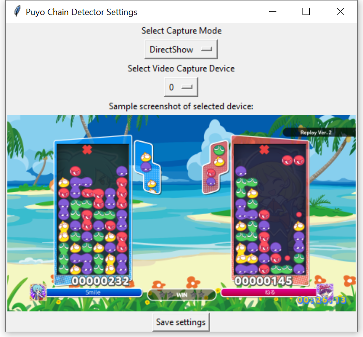
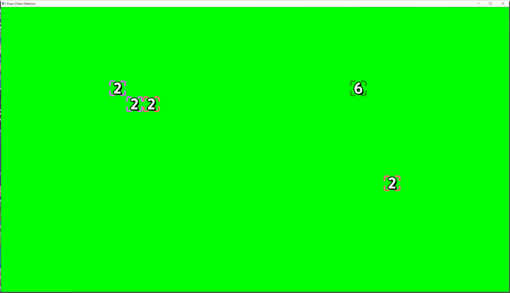

# Puyo Chain Detector
A real-time overlay for showing trigger points in Puyo chains.


## Setup
First, run `setup.exe` to pick your capture method and capture device. The ID for your capture device can change if you change how it's connected to your computer, so you might have to run this again later.



Then run `chaindetector.exe`. It'll take some time to load. If everything's fine, a green screen should appear:



You can Window Capture this in OBS and stretch it over your game screen. Then you need to Chroma Key it with a filter. My settings for this are:

* Similarity: 150
* Smoothness: 80
* Color Spill Reduction: 100
* Opacity: 66


## PyInstaller commands
Built under Python version 3.7.4

### Chain Detector
```bash
pyinstaller main.py --exclude-module=jupyter --exclude-module=ipython --exclude-module=jedi --exclude-module=matplotlib --exclude-module=ipykernel --exclude-module=ipython-genutils --exclude-module=ipywidgets --exclude-module=notebook --hidden-import=scipy.special.cython_special --hidden-import=sklearn.neural_network --onefile --add-binary="venv/Lib/site-packages/cv2/opencv_videoio_ffmpeg430_64.dll:." --add-binary="venv/Lib/site-packages/sklearn/.libs/vcomp140.dll:."
```

### Setup Tool
```bash
cd capture-setup

pyinstaller settings.py --exclude-module=jupyter --exclude-module=ipython --exclude-module=jedi --exclude-module=matplotlib --exclude-module=ipykernel --exclude-module=ipython-genutils --exclude-module=ipywidgets --exclude-module=notebook --onefile --noconsole --add-binary="../venv/Lib/site-packages/cv2/opencv_videoio_ffmpeg430_64.dll:."
```