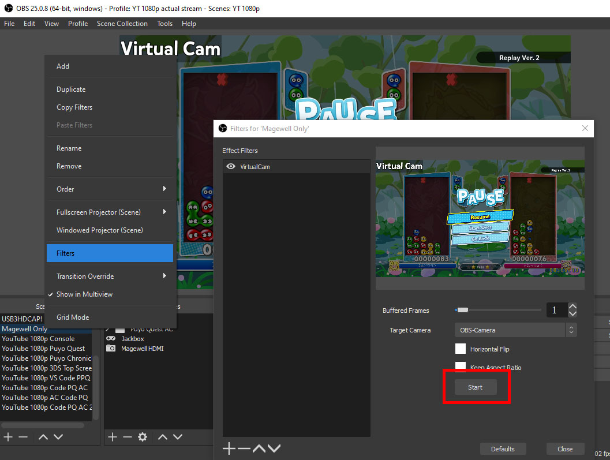
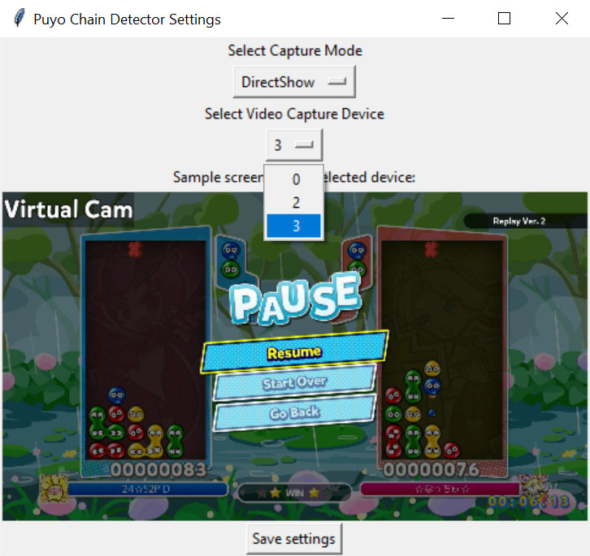

# Puyo Chain Detector
A real-time overlay for showing trigger points in Puyo chains.


## Download
[https://github.com/puyogg/puyo-chain-detector/releases](https://github.com/puyogg/puyo-chain-detector/releases)

## Setup
The Chain Detector uses computer vision to analyze the game screen, so it needs access to a live video feed. Here's two methods to get this working:

1. **Capture a DirectShow device (capture card)**. This is the most convenient method, and it should work with modern capture cards (e.g. Avermedia, Elgato HD60s or later). Older Elgatos probably won't work.
2. **Pass an OBS scene/source as a virtual camera**. This is a workaround that can work with any capture card or the PC Puyo Puyo games. You have to remember to start the Virtualcam service every time you load OBS, but this also lets you use the tool to analyze other people's videos.

### Method 1: Capture DirectShow Device
Run `setup.exe` to pick your capture method and capture device.


Select "DirectShow" as the capture mode. For the capture device, try out all the numbers in the list until your capture card shows up. If none of the numbers work, that means your device couldn't be detected, and you need to use Method 2 (virtual camera).

Click "Save settings" to save your capture mode and device id to a `settings.json` file.

### Method 2: OBS Virtualcam
Install the [OBS Virtualcam](https://obsproject.com/forum/resources/obs-virtualcam.949/) plugin for OBS Studio.

You can now right-click on an OBS Scene or Source and add a Virtualcam as an Effect Filter. Click "Start" to start broadcasting the OBS source as a virtual webcam.



When you run `setup.exe`, select DirectShow as the capture method. The virtual camera should show up as new number in the device list.



Click "Save settings" to save your capture mode and device id to a `settings.json` file.

### Green Screen
Once you have your settings saved, run `Detector.exe`. You should see a quick glimpse of your capture feed, and then it'll show a green screen.

## Potential setup errors

* **The code execution cannot proceed because VCRUNTIME140_1.dll was not found. Reinstalling the program may fix the problem.**
  
  Download and install the x64 redistributable for Microsoft Visual C++ 2015/2017/2019: https://support.microsoft.com/en-us/help/2977003/the-latest-supported-visual-c-downloads


Window Capture this in OBS and stretch it over your game screen. Then, apply a Chroma Key Filter. My settings for this are:

* Similarity: 150
* Smoothness: 80
* Color Spill Reduction: 100
* Opacity: 66

## PyInstaller commands
Built under Python version 3.7.4

### Setup Tool
```bash
cd capture-setup

pyinstaller settings.py --exclude-module=jupyter --exclude-module=ipython --exclude-module=jedi --exclude-module=matplotlib --exclude-module=ipykernel --exclude-module=ipython-genutils --exclude-module=ipywidgets --exclude-module=notebook --onefile --noconsole --add-binary="../venv/Lib/site-packages/cv2/opencv_videoio_ffmpeg430_64.dll:."
```