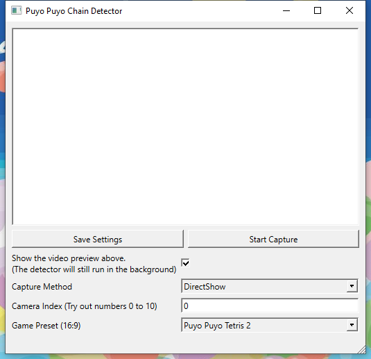

# Puyo Chain Detector - v2
A real-time overlay for showing trigger points in Puyo chains. Useful for showing newbies how experts plan their chains.

## Tools Used
For the tech recruiters who are actually looking at this GitHub page 😳

- **PyTorch** - designing the color recognition MLP model
- **OpenCV** - capture feed, image processing, DNN module for color recognition model
- **Qt6** - the desktop app GUI
- **Boost::Beast** - C++ websocket server to send chain data to the BrowserSource
- **JS/Canvas API** - drawing the number and color cursors on the BrowserSource

## Installation and Set Up

1. Download the latest version from the [releases page](https://github.com/puyogg/puyo-chain-detector/releases).

2. Extract the zip file and open **PuyoChainDetector.exe**. You should see a screen like this:

3. I haven't implemented a way to autodetect capture cards yet; so instead, guess a **Camera Index** number in the field at the bottom and click **Start Capture**. Keep trying different numbers until your game shows up.

4. The chain detector is now calculating your chains in the background. To view the results in an overlay, add `overlay.html` as a BrowserSource in OBS.

Recommended settings
    - Width: 1920px
    - Height: 1080px
    - FPS: 30

### VirtualCam Workaround / Overlaying other people's videos

Old capture cards (e.g. Elgato HD60) won't show up as a compatible capture device in the chain detector settings. If you've tried a bunch of IDs and none of them work, you can try turning an OBS Scene into a virtual capture source.

1. Install the OBS VirtualCam plugin from here: https://obsproject.com/forum/resources/obs-virtualcam.949/

2. Right-click on a clean scene containing your video feed. Choose **Filters**

3. Add a **VirtualCam filter**, then click **Start**

4. Try some camera ID numbers again in the main app. One of them should be your virtualcamera source.

<!--
## Building the chain detector from source (Windows)

Dependencies:
- Qt6
- JsonCpp
- OpenCV v4.5.1
- Boost v1.75.0

### 1. Install OpenCV

- Download and extract the prebuilt binaries by following the links on the OpenCV Docs: https://docs.opencv.org/4.5.1/d3/d52/tutorial_windows_install.html#tutorial_windows_install_prebuilt
- Set an environment variable named `OpenCV_DIR` to the extraction path, specifically down to one of the `\lib` directories. For example, i have `OpenCV_DIR` set to `C:\OpenCV\build\x64\vc15\lib`. This ensures that it'll link correctly with CMake.

### 2. Install Boost (with static libs enabled)
I don't even know what I did half the time lol.

- Download the 7z file from this [link](https://www.boost.org/doc/libs/1_75_0/more/getting_started/windows.html) and extract it to a directory, e.g. `C:\boost_1_75_0`
- From the command line, cd to the extracted Boost directory and run `.\BOOTSTRAP.bat` followed by `.\b2` (it takes forever).
- Set these environment variables so CMake finds everything:
    - **BOOST_INCLUDEDIR**: `C:\boost_1_75_0\`
    - **BOOST_LIBRARYDIR**: `C:\boost_1_75_0\stage\lib`
    - **BOOST_ROOT**: `C:\boost_1_75_0\` -->